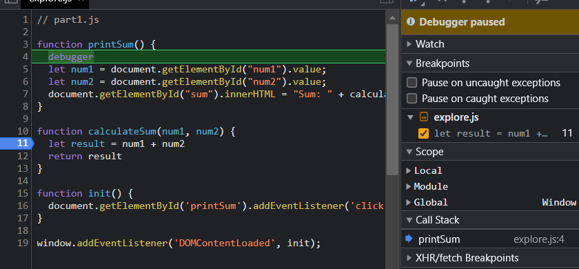
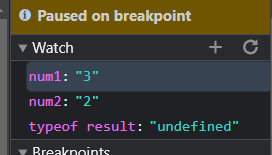
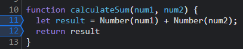

Breakpoint:  

Watch Expressions:  

 

1. The issue is that num1 and num2 are both strings. Therefore, when we add them, they get concatenated rather than being added numerically.
2. We can fix this by using the Number() function which can convert the strings to numbers before adding them. 

